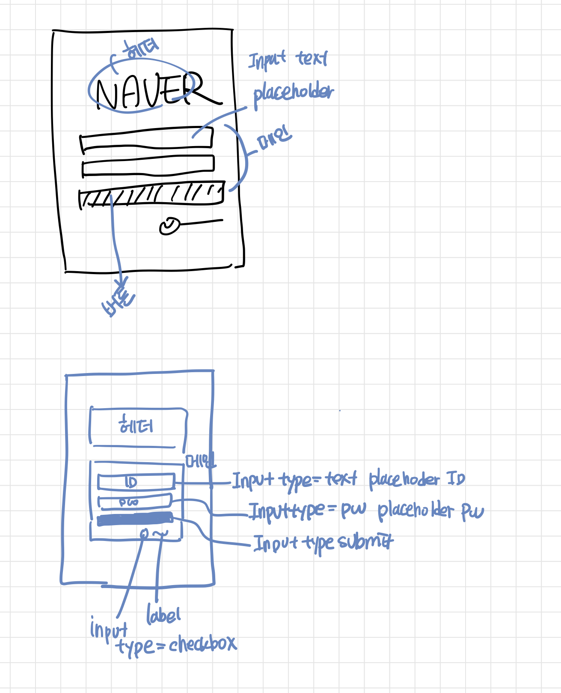
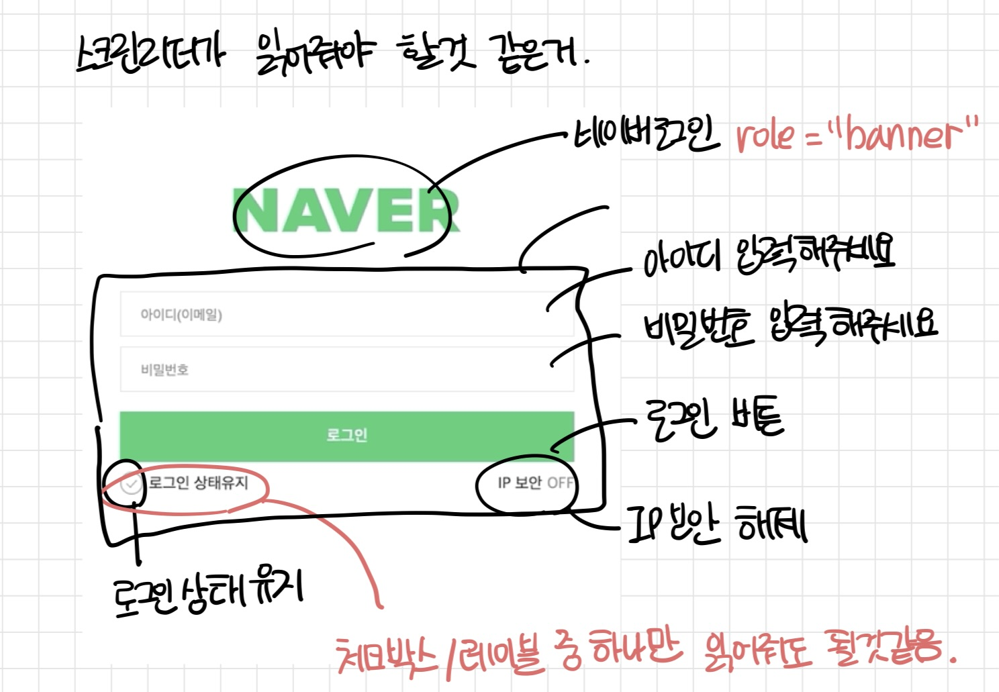

몸이 안 좋아서 마크업만이라도 해보았습니다. 😢
> 손 마크업    

   
    

네이버 로고는 헤더   
아이디, 비밀번호, 로그인버튼, 기억하기 등은 메인   
ID 입력칸은 Input type=text / placeholder 아이디(이메일)   
비밀번호 입력칸은 Input type=password / placeholder 비밀번호   
로그인 버튼은 Input type=submit   
로그인 상태유지는 Input type=checkbox 와 label 
## 예상   
### 마크업
- svg를 지원하는 웹브라우저는 svg 형식으로 그렇지 않은 웹브라우저는 png형식으로 보여지도록 구현    
=> **@support 로 하면 될 것 같다.**
- 웹접근성을 고려한 로그인 폼 서식 마크업   
=> **label의 for랑 input의 id를 연결해서 레이블 눌러도 체크박스 눌리게.**
- 아이디와 비밀번호는 필수 입력 서식임을 알 수 있도록 구현   
=> **required를 줘서 구현**
- IP 보안 텍스트 클릭 시 미리 제공 된 ip_secruity.html 파일이 새창에 보이도록 구현   
=> **a태그와 새창이니까 _blank로 구현**    
- 로그인 상태유지와 IP 보안 ON/OFF는 스위치는 키보드로도 조작 가능하도록 구현   
=> 키보드 조작을 위해서 

## 의문점
~~~
<label for="login-stay">
        <input type="checkbox" id="login-stay"/>로그인 상태유지
</label>
~~~
1.아이디는 카멜케이스를 달아야 하는데 그럼 로그인에도 카멜 케이스를 달면 되나? - for를 그냥 카멜케이스 쓰면 되겠네.